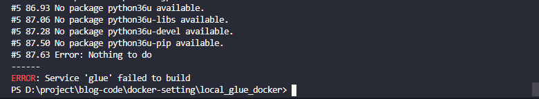

最近、お仕事で Glue を使った開発を行っていたため、備忘録として

Glue の開発エンドポイントを使えない場合(料金的にも)local で開発することができます
また、localstack と組み合わせることで、local 開発のみでいろいろと試せるため、何かと便利です。
今回は localstack の S3 を用いて、localGlue で入出力を行いたいと思います

# 環境

docker 内で作業するため、あまり関係ないですが

|                | バージョン |
| -------------- | ---------- |
| windows        | 10         |
| docker         | 20.10.5    |
| docker-compose | 1.28.5     |

# Glue の Dockerfile

[AWS Glue の開発エンドポイントがそこそこお高いのでローカル開発環境を用意しました](https://future-architect.github.io/articles/20191101/)
↑ まんま用意されているので、こちらを使おうと思ったら、以下のようなエラーが出た


ため、上記を少し修正しました

```Dockerfile
FROM centos:7

RUN yum install -y bzip2 bzip2-devel gcc gcc-c++ make openssl-devel readline-devel zlib-devel wget curl unzip vim epel-release git \
    && yum install -y tig jq vim-enhanced bash-completion net-tools bind-utils \
    && yum install -y python3 python3-libs python3-devel python3-pip \
    && yum install -y java java-1.8.0-openjdk-devel \
    && rm -rf /var/cache/yum/*

RUN localedef -f UTF-8 -i ja_JP ja_JP.UTF-8
ENV LANG ja_JP.UTF-8
ENV LC_CTYPE "ja_JP.UTF-8"
ENV LC_NUMERIC "ja_JP.UTF-8"
ENV LC_TIME "ja_JP.UTF-8"
ENV LC_COLLATE "ja_JP.UTF-8"
ENV LC_MONETARY "ja_JP.UTF-8"
ENV LC_MESSAGES "ja_JP.UTF-8"
ENV LC_PAPER "ja_JP.UTF-8"
ENV LC_NAME "ja_JP.UTF-8"
ENV LC_ADDRESS "ja_JP.UTF-8"
ENV LC_TELEPHONE "ja_JP.UTF-8"
ENV LC_MEASUREMENT "ja_JP.UTF-8"
ENV LC_IDENTIFICATION "ja_JP.UTF-8"
ENV LC_ALL ja_JP.UTF-8

# Glueライブラリ取得
RUN git clone -b glue-1.0 --depth 1  https://github.com/awslabs/aws-glue-libs

# Maven取得
RUN curl -OL https://archive.apache.org/dist/maven/maven-3/3.6.2/binaries/apache-maven-3.6.2-bin.tar.gz
RUN tar -xzvf apache-maven-3.6.2-bin.tar.gz
RUN mv apache-maven-3.6.2 /opt/
RUN ln -s /opt/apache-maven-3.6.2 /opt/apache-maven
ENV JAVA_HOME /usr/lib/jvm/java-1.8.0-openjdk/jre/
ENV PATH $PATH:/opt/apache-maven/bin
RUN mvn -version

# Glueアーティファクト取得
RUN curl -OL https://aws-glue-etl-artifacts.s3.amazonaws.com/glue-1.0/spark-2.4.3-bin-hadoop2.8.tgz
RUN tar -xzvf spark-2.4.3-bin-hadoop2.8.tgz
RUN mv spark-2.4.3-bin-spark-2.4.3-bin-hadoop2.8 /opt/
RUN ln -s /opt/spark-2.4.3-bin-spark-2.4.3-bin-hadoop2.8 /opt/spark
ENV SPARK_HOME /opt/spark

# Python3を利用する設定
RUN unlink /bin/python
RUN ln -s /bin/python3 /bin/python
RUN ln -s /bin/pip3 /bin/pip

# 異なるバージョンのjarがsparkとglueに混在するので適切なバージョンのみを見るよう設定
RUN ln -s ${SPARK_HOME}/jars /aws-glue-libs/jarsv1
RUN ./aws-glue-libs/bin/gluepyspark
ENTRYPOINT ["/bin/sh", "-c", "while :; do sleep 10; done"]
```

# docker-compose の設定

上記 Dockerfile と localstack を使う compose を定義します

```yml
version: '3'
services:
  localstack:
    container_name: localstack
    image: localstack/localstack:0.10.9
    ports:
      - 8080:8080
      - 4566-4597:4566-4597
    environment:
      - DEFAULT_REGION=us-east-1
      - SERVICES=s3
      - AWS_ACCESS_KEY_ID=hoge
      - AWS_SECRET_ACCESS_KEY=hoge
  glue:
    container_name: glue
    build: .
    volumes:
      # スクリプトを共有するフォルダ
      - ./share:/share
    environment:
      - AWS_DEFAULT_REGION=us-east-1
      # GlueからLocalstackを用いる際に、access_keyとsecret_keyが同じになっている必要がある
      - AWS_ACCESS_KEY_ID=hoge
      - AWS_SECRET_ACCESS_KEY=hoge
```

**localstack は、あるバージョンから各サービスのポートが一つにまとまってしまったためガラッと使用感が変わっているので注意してください**

詳しくは[localstack の Github](https://github.com/localstack/localstack)に乗っています(確か)

↑ 乗ってました

> 2019-10-09: LocalStack Pro is out! We're incredibly excited to announce the launch of LocalStack Pro - the enterprise version of LocalStack with additional APIs and advanced features. Check out the free trial at https://localstack.cloud

# Glue を使ってみる

localGlue には[3 つのスクリプト](https://docs.aws.amazon.com/ja_jp/glue/latest/dg/aws-glue-programming-etl-libraries.html#local-run-python-job)が用意されています

- gluepyspark
  - 対話モードで gluepyspark を動かしたいならこれ
- gluesparksubmit
  - スクリプト実行したいならこれ
- gluepytest
  - テストしたい場合これ

今回は対話型を起動するまで、で

### 1: glue イメージにアタッチする

compose で立ち上げて、対象の image にアタッチします

```sh
$ docker-compose up -d
$ docker-compose exec glue ./bin/bash
[root@edfaf015156a /]#
```

### 2: 対話型を立ち上げる

アタッチしたパスから aws-glue-libs/bin/直下に上記 3 つのスクリプトがあります

```sh
[root@edfaf015156a /]# aws-glue-libs/bin/gluepyspark
...省略
Welcome to
      ____              __
     / __/__  ___ _____/ /__
    _\ \/ _ \/ _ `/ __/  '_/
   /__ / .__/\_,_/_/ /_/\_\   version 2.4.3
      /_/

Using Python version 3.6.8 (default, Nov 16 2020 16:55:22)
SparkSession available as 'spark'.
>>>
```

上記のように出れば成功ですー

# Glue で localstackS3 を用いて入出力

テスト用の csv か何か用意してください
おすすめは kaggle にある[ポケモンデータ](https://www.kaggle.com/abcsds/pokemon)です

## バケット・データを localstackS3 に用意する

読み込むデータと、バケットを localstack の S3 に用意します

方法は、aws cli を使う感覚と全く同じですが、後ろに[--endpoint-url](https://docs.aws.amazon.com/ja_jp/cli/latest/userguide/cli-configure-options.html)パラメータを渡してあげないといけないです

```sh
# 4572ポートがs3
$ aws s3 mb s3://test-csv --endpoint-url="http://localhost:4572"
make_bucket: test-csv
$ aws s3 cp Pokemon.csv s3://test-csv/ --endpoint-url="http://localhost:4572"
upload: Pokemon.csv to s3://test-csv/Pokemon.csv
```

これで localstack を用いた s3 側の準備は OK です

次にスクリプトです。
注意点は**localGlue は from_catalog が使用できない**ということです

```py
import sys
import json
from pyspark.context import SparkContext
from awsglue.context import GlueContext
from awsglue.job import Job
from awsglue.utils import getResolvedOptions

job_params = [
    'JOB_NAME',
]

args = getResolvedOptions(sys.argv, job_params)

# ローカルs3を対象にするため、hadoopにendpointの設定を行う
sc = SparkContext()
sc._jsc.hadoopConfiguration().set("fs.s3a.endpoint", "http://localstack:4572")
sc._jsc.hadoopConfiguration().set("fs.s3a.path.style.access", "true")
sc._jsc.hadoopConfiguration().set("fs.s3a.signing-algorithm", "S3SignerType")

glue_context = GlueContext(sc)
spark = glue_context.spark_session
job = Job(glue_context)
job.init(args['JOB_NAME'], args)

dyf = glue_context.create_dynamic_frame.from_options(
    connection_type="s3",
    connection_options={
        "paths": ["s3a://test-csv/"]
    },
    format="csv",
    format_options={
        "withHeader": True
    },
)

# ここでdyfに対して何かしら処理をする

glue_context.write_dynamic_frame.from_options(
    frame=dyf,
    connection_type="s3",
    connection_options={
        "path": "s3a://test-csv/write/"
    },
    format='csv'
)

job.commit()
```

中身は[公式サンプル](https://github.com/awslabs/aws-glue-blueprint-libs)を参考に、localstack 用に弄りました
s3a とか s3n とかの違いは[こちら](https://aws.amazon.com/jp/premiumsupport/knowledge-center/emr-file-system-s3/)を参照ください

次に、スクリプトとして実行します

```sh
[root@edfaf015156a /]# aws-glue-libs/bin/gluesparksubmit /share/glue.py --JOB_NAME 'test'
...# 省略
21/04/05 14:41:16 INFO SparkContext: Successfully stopped SparkContext
21/04/05 14:41:16 INFO ShutdownHookManager: Shutdown hook called
21/04/05 14:41:16 INFO ShutdownHookManager: Deleting directory /tmp/spark-d2b1e11e-f253-4949-a5eb-b627cd9d7610/pyspark-7ae5c6ac-d888-499a-9e33-112f255c5bef
21/04/05 14:41:16 INFO ShutdownHookManager: Deleting directory /tmp/spark-d2b1e11e-f253-4949-a5eb-b627cd9d7610
21/04/05 14:41:16 INFO ShutdownHookManager: Deleting directory /tmp/spark-78c7a151-ac61-412e-bc92-eb1351e04f3a
[root@edfaf015156a /]#
```

Successfully となっていて、作業ディレクトリも削除されていることが log で出力されます

最後に中身を確認します

```
[root@7e42382cfe7a /]# aws s3 ls s3://test-csv/write/ --endpoint-url="http://localstack:4572"
2021-04-05 14:41:16      44230 run-1617633674695-part-r-00000
```

中身確認しませんが、まぁ大丈夫でしょう!

## 参考資料

[AWS Glue ETL ライブラリを使用した ETL スクリプトのローカルでの開発とテスト](https://docs.aws.amazon.com/ja_jp/glue/latest/dg/aws-glue-programming-etl-libraries.html)

[AWS Glue の開発エンドポイントがそこそこお高いのでローカル開発環境を用意しました](https://future-architect.github.io/articles/20191101/)
