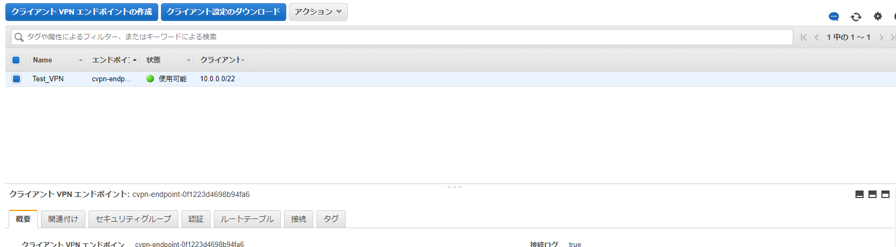
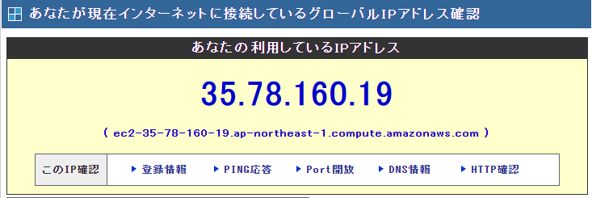

## はじめに
awsのclient vpnを用いて自分だけのVPN環境を構築したいと思います
なぜClient VPNを構築私用と思ったか...は話すと長くなりますが...

```
忘れもしない2021/11/27日土曜日。一体インターネッツで何が起こったのかを...
休日の朝。普段のようにベッドから起きた自分は、今日もネッツゲームをやる気満々だった。まずはdis〇〇サーバへJOIN!
と思いきや...接続できない...

まぁ焦らない焦らない。Dis〇〇もこんなことはたまにはあるやんな。と思い原〇を起動...つながらない...
あれ...ネットワーク死んだか?怪しんだ自分はまずpingが通るか確認...問題なし
え...サイトとかも普通に見える...どうなっていやがる...

俺のインターネッツは一体...今...どうなってやがるんだああああああ(半日経過)

```

っとまぁそんな感じで半日**一部通信の**インターネッツが通信できなくなってしまいました...

11/27日に上位ISPで特定通信がFilterされてしまい通信できない状態となってしまいました。
> https://matomebu.com/news/ntt20211127/

この回避方法として有名な方法がVPNがあるため(某countryでネット規制がかかった際にアプリDL一位がVPNアプリだったとかなんとか)VPNなんかいいのないかなぁと調べていました。

ただ、普段使いはしない為、数時間のためだけにVPNを契約なんてしたくないなぁと思い、探していたらAWSにVPNサービスがあり、それを用いてVPN構築した備忘録です。

## 環境
* windows10
* Open VPN
* aws cli/2.7.12
* python 3.9.1
* EasyRSA 3.1.0

## 前準備
上記環境についてのインストール等は特に述べていないので、適宜インストールしてください

## AWS Client vpnについて

AWSではVPNを提供しています。種類は調べたところ以下2種類ありました
* Site-to-Site VPN
* Client VPN

Site-to-Site VPNはルータで完結するサイト間VPN、Client VPNがソフトを入れて通信するリモートアクセスVPNのイメージです
今回はOpen VPNをインストールし、Client VPNを用いてVPN化していきます

また、Client VPNの構築内容はAWS公式にあります[インターネットへのアクセス](https://docs.aws.amazon.com/ja_jp/vpn/latest/clientvpn-admin/scenario-internet.html)を参考に、CDK化し構築していこうと思います。

Client VPNには認証方法が3種類あるのですが、相互認証を用います

## Client VPN作成
[公式テンプレート](https://docs.aws.amazon.com/cdk/v2/guide/hello_world.html) を使用します

```bash
$ cdk init app --language python
$ source .venv/bin/activate
$ python -m pip install -r requirements.txt
```

ディレクトリ名/ディレクトリ名_stack.pyとなっているファイルを開き、VPCとVPNを記載していきます。
自分の場合はaws_cdk_vpn_stack.pyで作成されていました
```python:title=aws_cdk_vpn_stack.py
from aws_cdk import (
    # Duration,
    Stack,
    # aws_sqs as sqs,
    aws_ec2
)
from constructs import Construct


class AwsCdkVpnStack(Stack):

    def __init__(self, scope: Construct, construct_id: str, certificate_arn: str, **kwargs) -> None:
        super().__init__(scope, construct_id, **kwargs)

        vpc = aws_ec2.Vpc(
            self,
            "Vpc_CDK",
            cidr="172.31.0.0/16",
            max_azs=1,
            subnet_configuration=[
                aws_ec2.SubnetConfiguration(
                    name='Public-Subent',
                    subnet_type=aws_ec2.SubnetType.PUBLIC,
                    cidr_mask=20
                ),
            ],
        )

        isubnet = vpc.public_subnets

        client_vpn = aws_ec2.ClientVpnEndpoint(
            scope=self,
            id="Client_VPN",
            vpc=vpc,
            cidr="10.0.0.0/22",
            authorize_all_users_to_vpc_cidr=False,
            split_tunnel=False,
            server_certificate_arn=certificate_arn,
            client_certificate_arn=certificate_arn,
        )

        client_vpn.add_authorization_rule(
            id="auth",
            cidr="0.0.0.0/0",
        )

        for isub in isubnet:
            client_vpn.add_route(
                id="routing",
                cidr='0.0.0.0/0',
                target=aws_ec2.ClientVpnRouteTarget.subnet(subnet=isub)
            )

```

不要なコメント等があるので適宜削除してください

VPC, VPN等CDKで作成に困った際は[こちら](https://docs.aws.amazon.com/cdk/api/v2/python/aws_cdk.aws_ec2/ClientVpnEndpoint.html?highlight=clientvpnendpoint#clientvpnendpoint)と[こちら](https://github.com/aws-samples/aws-cdk-examples/tree/master/python)を参考に作成しました

今回自分用のVPNかつ、全通信をインターネットに向けるだけなので、routing部分で全通信を指定のサブネットに流すように設定しましたが、awsリソースにVPNを用いてアクセスさせたい。等の場合はルーティング等をしっかりと設定してください

また、ClientVpnEndpointのsplit_tunnelはFalseに設定します。Trueにした場合インターネット側通信がVPNトンネルを通らなくなるroutingになるようです(ただ、夢系で言えばTrueにして、特定の通信のみのroutingを追加したほうが良いと思いますが、そんな根気はないのでやりません)

app.pyファイルも少し変更します
```python:title=app.py
#!/usr/bin/env python3
import os

import aws_cdk as cdk

from aws_cdk_vpn.aws_cdk_vpn_stack import AwsCdkVpnStack
from dotenv import load_dotenv

load_dotenv()

app = cdk.App()
certificate_arn = os.environ['CERTIFICATE_ARN']
client_vpn = AwsCdkVpnStack(app, "AwsCdkVpnStack", certificate_arn)

cdk.Tags.of(client_vpn).add('Name', 'Test_VPN')

app.synth()
```

後ほどインポートするACMのarn情報が必要なので、それをStackのリソースに対して適用できればどんな記述でもOKです

自分の場合はdotenvを用いて、.envファイルに記載しました

## 相互認証準備
[公式ドキュメント](https://docs.aws.amazon.com/ja_jp/vpn/latest/clientvpn-admin/client-authentication.html#mutual)に手順が載っているので、こちらを参考に作成していきます
先ほど作成したテンプレートの直下に

```bash
cd .\EasyRSA-3.1.0\
.\EasyRSA-Start.bat
./easyrsa init-pki
./easyrsa build-ca nopass
./easyrsa build-server-full server nopass
./easyrsa build-client-full client1.domain.tld nopass
exit
mkdir ../certificate
copy pki\ca.crt ../certificate
copy pki\issued\server.crt ../certificate
copy pki\private\server.key ../certificate
copy pki\issued\client1.domain.tld.crt ../certificate
copy pki\private\client1.domain.tld.key ../certificate
cd ../certificate
aws acm import-certificate --certificate fileb://server.crt --private-key fileb://server.key --certificate-chain fileb://ca.crt
```

ACMに証明書をインポートするコマンドも入っているので必要に応じてaws cliをインストールしてください
arn情報が必要なため、コピーしCDKリソースで使用できるようにしてください

## CDK Deploy
CDKをデプロイしていきます
```
$ cdk deploy
...

 ✅  AwsCdkVpnStack

✨  Deployment time: 459.08s

Stack ARN:
arn:aws:cloudformation:ap-northeast-1:576272532983:stack/AwsCdkVpnStack/xxxxxxxxxxxxxxxxxxxxxxxxxxxxxxxxxxxxxxxxxx

✨  Total time: 486.84s
```

結構デプロイに時間かかるなぁと...

## Open VPN接続
最後に、client vpnエンドポイントのクライアント設定のダウンロードを行い、Open VPNの設定に記述します


```bash:title=openvpn
client
dev tun
proto udp
remote cvpn-endpoint-xxxxxxxxxxxxxxxxxxx.prod.clientvpn.ap-northeast-1.amazonaws.com 443
remote-random-hostname
resolv-retry infinite
nobind
remote-cert-tls server
cipher AES-256-GCM
verb 3
<ca>
-----BEGIN CERTIFICATE-----
xxxxxxxxxxxxxxxxxxxxxxxxxxxxxxxxxx
-----END CERTIFICATE-----

</ca>

# これを追記する
cert C:\\Path\\client1.domain.tld.crt
key C:\\client1.domain.tld.key

reneg-sec 0
```

cert, keyを追記します。それぞれ相互認証時に作成したclient1.domain.tld.crtとclient1.domain.tld.keyを指定します

上記が完了し、接続を開始すればClient VPNを用いたVPN接続環境の完成です!

11/27日に行ってテストしたいところですが、それは行えないのでIPアドレスが変わっているか確認します


明らかAWSのIPになっていますが、不安であればVPNを切った後にIPアドレスが変化するか見ていただければと思います!

## 使ってみて所感
普段AWS使っていたり、慣れている人であれば一時的にVPNを使いたい際はかなり良い選択ではないかなと思います。特に契約等が存在しないのも良きですね。ただ、数日間単位で使うようでしたらどっかのVPN契約して使ったほうが安くつきそうです(やりたいことによりますが)

次は今回filterでブロックされた通信のみをルーティングに追加して、該当通信のみをVPN経由にする設定もして置きたいですね。(料金で眼球飛び出ないためにも)

今回の実際のソースコードを確認したい方が居ましたら[Githubリポジトリ](https://github.com/takap-sandbox/aws-client-vpn)を確認ください。
